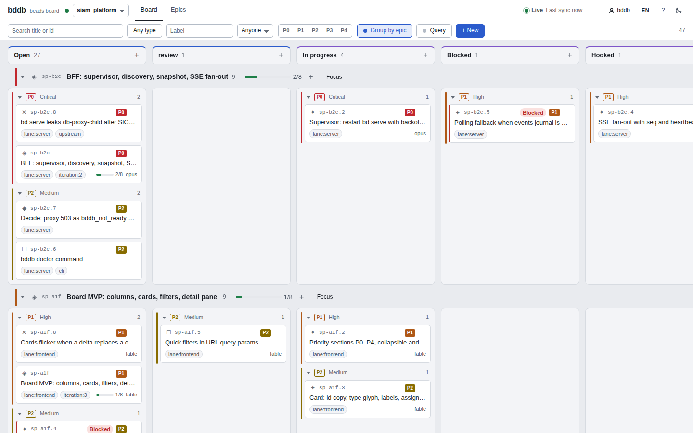
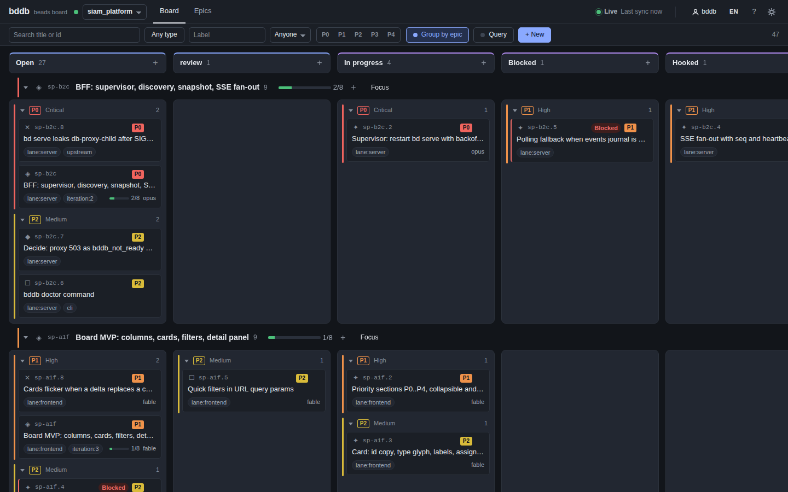

# bddb — kanban dashboard for beads

**bddb** is a web kanban board for [beads](https://github.com/gastownhall/beads), the
issue tracker for coding agents. It reads and writes issues exclusively through the
`bd serve` HTTP API (beads 1.3.0+). Know the limits before you start: **embedded-mode
workspaces are not supported**, because `bd serve` requires a Dolt SQL server (`bd init
--server` or `--shared-server`); **the dashboard has no authentication** — protect it with
your network or a reverse proxy; and **live updates from changes made by agents through the
CLI require `bd config set events-journal true`** in each workspace they write from, otherwise
those changes appear only on the next polling cycle.





## Status

Pre-release (`0.x`): the feature set below is implemented and tested against beads
`1.3.0-rc.2`; the API and the UI may still change between minor versions. Target
compatibility: beads `1.3.0-rc.2` and later on the same minor ([docs/compatibility.md](docs/compatibility.md)).

## What it does

- Kanban board per database: columns by status (built-in plus `status.custom`), cards in
  priority sections P0–P4, resizable columns, quick filters (text, type, label, assignee,
  priority) and a `bd query` expression mode, light and dark themes, English and Russian UI.
- Hierarchy: swimlanes per epic, drill-down into an epic with breadcrumbs, an epics view with
  progress, and a parent / children / dependency tree in the issue drawer.
- Editing: create issues, drag-and-drop between statuses, priorities and epics (multi-select
  too), close / reopen with a reason and a force dialog, comments, labels, `blocks`
  dependencies, claim / release, every field of an issue — all with optimistic-concurrency
  guards (`expected_version`) and a conflict dialog.
- Live updates through the `bd serve` events journal (SSE) with full-reread polling as a
  fallback; the header says which one is in effect.
- Keyboard-first: Tab and arrows move between cards, Enter opens, Space menus, `/` filters,
  `n` creates, `?` lists the shortcuts; dialogs trap focus; both themes pass WCAG AA contrast.
- Several databases of one Dolt server with a project switcher; clear on-screen states when a
  database is starting, its `bd serve` is down, Dolt is unreachable or the dashboard server
  itself is gone — with the same hints `bddb doctor` prints.
- Shipped as a Docker image (`ghcr.io/umum-ai/bddb`) and a single binary.

## Quick start (Docker)

The image `ghcr.io/umum-ai/bddb` (linux/amd64, linux/arm64) contains only the dashboard and the
`bd` binary. Your `dolt sql-server` and data stay on your host; the container connects to Dolt
over TCP.

```sh
docker run --rm -p 7331:7331 \
  --add-host=host.docker.internal:host-gateway \
  -e BDDB_DOLT_HOST=host.docker.internal \
  -e BDDB_DOLT_PORT=3308 \
  ghcr.io/umum-ai/bddb
```

Then open <http://localhost:7331>. `docker run --rm … ghcr.io/umum-ai/bddb doctor` checks the
connection first (`version` prints the bddb and beads versions).

Your Dolt server must accept connections from the container: `listener.host: 0.0.0.0` in
`dolt-server-config.yaml` of the shared server **and** a user allowed from remote hosts (a fresh
dolt has `root@localhost` only — see [docs/host-setup.md](docs/host-setup.md)). On Linux you can
instead use `--network host` with `-e BDDB_DOLT_HOST=127.0.0.1` and keep Dolt on loopback.
`--add-host` is needed on Linux Docker Engine only (Docker Desktop and OrbStack resolve
`host.docker.internal` themselves). A password-less Dolt listening on `0.0.0.0` exposes all of
its data to your network — restrict it accordingly.

The `bd` inside the image must match your host's `bd` **minor** version: the image label
`org.beads.version` and `bddb version` say which beads it was built for
([docs/compatibility.md](docs/compatibility.md)). Compose file, reverse-proxy setup with
`BDDB_BASE_PATH`, health checks and upgrade notes: [docs/deployment.md](docs/deployment.md).

## Single binary

GitHub Releases carry `bddb-<version>-{linux,darwin}-{x64,arm64}.tar.gz` with a `.sha256` each.
The binary embeds the dashboard and the bun runtime; it needs `bd` (same minor as your host
beads) and `git` in `PATH`:

```sh
tar -xzf bddb-0.1.0-linux-x64.tar.gz && install -m 0755 bddb-linux-x64 ~/.local/bin/bddb
bddb doctor --dolt-host 127.0.0.1 --dolt-port 3308      # all ✓ ?
bddb serve  --dolt-host 127.0.0.1 --dolt-port 3308      # → http://localhost:7331
```

## How it works

```text
browser ──same origin──▶ bddb (one process, one port) ──loopback──▶ bd serve × N ──TCP──▶ your dolt sql-server
          SPA + /api + SSE   discovery, supervisor, snapshot, fan-out    one per database        (host, port 3308)
```

`bddb serve` connects to your Dolt once to list the beads databases (`SHOW DATABASES`, the only
SQL it ever runs), synthesizes a server-mode workspace per database and starts one `bd serve`
on a loopback port for each, supervised and restarted with backoff. Per database it keeps an
in-memory snapshot (issues, ready set, statuses, stats) fresh through **one** `events:watch`
stream plus a periodic full re-read, and fans out `snapshot` / `delta` / `status` frames to
every browser tab over SSE. Writes from the UI are proxied to `bd serve` unchanged (with the
actor you chose in the header), errors come back as the RFC 9457 problems `bd serve` produces.
The SPA (Preact) holds the snapshot, applies deltas and renders the board; nothing is stored
server-side except the synthesized workspaces in `BDDB_WORK_DIR`. Details:
[docs/topology.md](docs/topology.md), [docs/bff-api.md](docs/bff-api.md), [docs/ui.md](docs/ui.md).

## Running from source

```sh
bddb serve  [flags]     # start the dashboard (BFF + SPA); flags mirror the BDDB_* variables
bddb doctor [flags]     # check dolt, databases, bd, bd serve and the events journal
bddb version            # bddb version and the beads version it was built for
bddb help
```

`bddb` is `bun src/server/cli.ts` in a checkout (`bun run serve`, `bun run doctor`); the same
flags work for the single binary and inside the container. `mise run build` produces a
self-contained `dist/server` (`bun dist/server/cli.js serve`), `mise run build:binary` the single
executable.

`doctor` prints a ✓/✗ table — `bd` binary and version, `git`, Dolt reachability, discovered
databases, a temporary `bd serve` for the first database, the events journal — with a hint
under every failed row, and exits non-zero when a critical check fails:

```text
  ✓ bd binary            bd version 1.3.0-rc.2 (bd)
  ✓ git binary           git version 2.55.0
  ✗ dolt reachable       cannot connect to 127.0.0.1:3390
                         → is `dolt sql-server` running? shared-server mode: `bd dolt status` …
```

`serve` checks `bd`, discovers the databases (or takes `BDDB_DATABASES`), starts one `bd serve`
per database on a loopback port, and serves the board on `BDDB_HOST:BDDB_PORT`; it prints the
URL to open and one line per database as it comes up. When something is missing (Dolt
unreachable, no beads database, `bd` not found or unsupported) it prints the same hints as
`doctor` and exits 2 ([docs/configuration.md](docs/configuration.md#startup-failures)). Process
endpoints: `/healthz` (alive), `/readyz` (200 once a database is ready), `/api/meta`. Stop
with Ctrl-C; every `bd serve` it started is stopped too.

### Configuration

Full reference with flags and semantics: [docs/configuration.md](docs/configuration.md).

| Variable | Default | Purpose |
|---|---|---|
| `BDDB_HOST` / `BDDB_PORT` | `0.0.0.0` / `7331` | dashboard bind address |
| `BDDB_BASE_PATH` | (empty) | path prefix behind a reverse proxy, e.g. `/beads` |
| `BDDB_DOLT_HOST` / `BDDB_DOLT_PORT` | `host.docker.internal` / `3308` | your Dolt SQL server |
| `BDDB_DOLT_USER` / `BDDB_DOLT_PASSWORD` | `root` / (empty) | Dolt credentials |
| `BDDB_DATABASES` | auto-discovery | CSV of databases to serve |
| `BDDB_DEFAULT_DATABASE` | first in list | project opened by default |
| `BDDB_ACTOR` | `bddb` | default `actor` for writes |
| `BDDB_POLL_INTERVAL` | `15s` | polling fallback interval |
| `BDDB_CLOSED_DAYS` | `7` | window of closed issues shown on the board |
| `BDDB_BD_PATH` | `bd` from `PATH` | path to the `bd` binary |
| `BDDB_LOG_LEVEL` / `BDDB_LOG_FORMAT` | `info` / `text` | log verbosity and format (`text` or `json`) |
| `BDDB_WORK_DIR` | `$TMPDIR/bddb` | synthesized workspaces (one directory per running instance) |
| `BDDB_WEB_DIR` | embedded SPA | pre-built SPA directory (rarely needed) |

### Host setup

Details in [docs/host-setup.md](docs/host-setup.md); the short version:

- Move an embedded workspace to server mode: `bd export`, then `bd init --shared-server
  --reinit-local` (one Dolt for all your projects) or `bd init --server --external …`, then
  `bd import`.
- Enable the events journal in every workspace your agents write from:
  `bd config set events-journal true`. Without it the dashboard falls back to polling for
  those changes.
- Run `bddb doctor` to check Dolt connectivity, discovered databases, the `bd` version and
  the journal.

## Documentation

[docs/README.md](docs/README.md) is the index. In short: [topology](docs/topology.md) (what
runs where and why), [host setup](docs/host-setup.md), [configuration](docs/configuration.md),
[deployment](docs/deployment.md) (image, binary, reverse proxy, health), [compatibility](docs/compatibility.md)
(beads versions, pins, bump procedure), [BFF API](docs/bff-api.md) (the contract between the
server and the SPA), [api-client](docs/api-client.md) (the typed `bd serve` client),
[UI](docs/ui.md) (layout, keyboard shortcuts, states, mock and e2e).

## Development

Requires [mise](https://mise.jdx.dev).

```sh
mise install
bun install
mise run lint
mise run typecheck
mise run test
mise run dev
```

See [CONTRIBUTING.md](CONTRIBUTING.md) (stand, e2e, contract tests, PR checklist),
[AGENTS.md](AGENTS.md) (the operating manual for the agents maintaining this repository) and
[SECURITY.md](SECURITY.md).

## License

[MIT](LICENSE).
